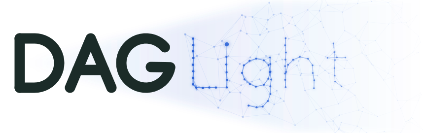
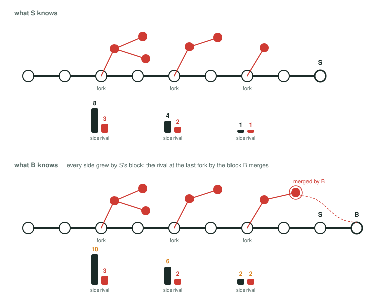
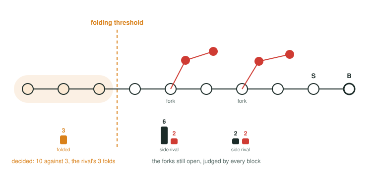
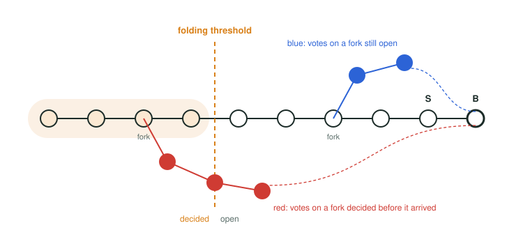
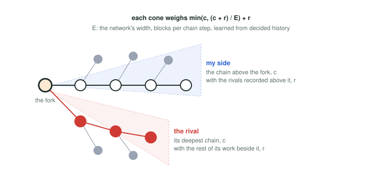
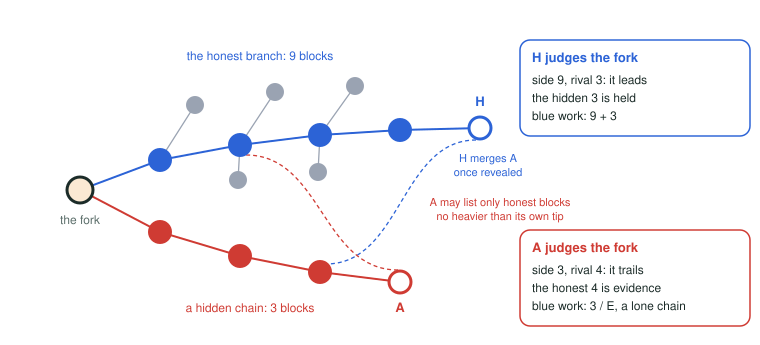
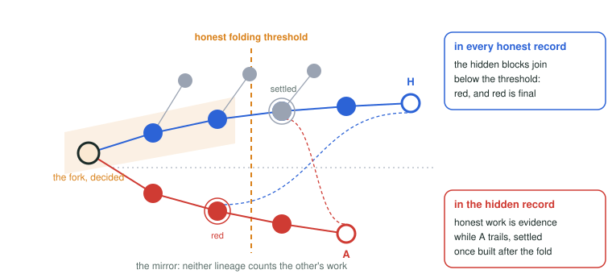
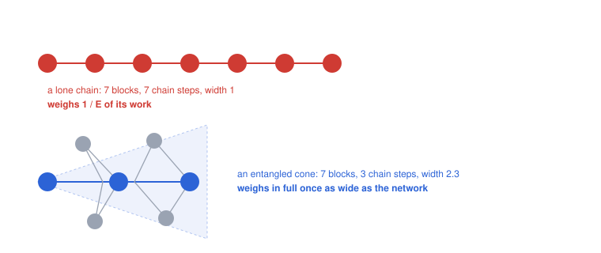

<picture>
  <source media="(prefers-color-scheme: dark)" srcset="docs/logo.svg">
  
</picture>

# DAGLight

**An incremental, adaptive colouring engine for GHOSTDAG protocols that learns from each block's
past light cone.**

**One idea, inverted.** DAGKnight tracks different `k` to find the majority cluster, its UMC;
DAGLight tracks the majority cluster to find `k`. Where DAGKnight raises `k` until one side of a
conflict holds the majority of the work on top, DAGLight watches each conflict until one side has
clearly won, reads honest and dishonest, blue and red, off that convergence, and learns the width
that `k` stood for from what has already converged. A parameter to search for becomes a measurement
to take, one that scales the verdict and never decides it.

A proof-of-work ledger is a vote that never ends: every block votes for its whole past, and the
heaviest history wins. In a block DAG a block still votes for one history, the chain of its selected
parent, but it also references every other block it has seen, the losing options included. That is
what lets parallel work count, and the only question left is which of the acknowledged work to
count. GHOSTDAG answers it with the shape of the DAG, a `k` on the size of anticones. DAGLight
answers it with what every block can see for itself: where the vote has already been decided, and
where it is still open.

Most of GHOSTDAG's machinery survives this unchanged. A block still has a selected parent and a
mergeset. Merged blocks are still blue or red, and only blue blocks feed blue work. Every node still
chooses the tip with the most blue work as its selected parent, and the mergeset is still ordered
with blues before reds. What changes is the colouring engine: how a block decides which merged
blocks are blue, and how much of their work it is credited with. Hence the name: a lighter
DAGKnight, whose `k` is a perception rather than a parameter.

This repository implements the engine in Rust, with a simulator that measures it honestly and under
attack, and a browser player for recorded runs, live at
[hmoog.github.io/daglight/visualisation/player](https://hmoog.github.io/daglight/visualisation/player/):
blocks attach, their work flows down the chains, the node folds the rest, and the folding threshold,
the finality point and the pruning point move up the chain, in honest runs and under attack. Every
frame is a real run, and nothing needs building to watch one.

## A block's perception

Every block carries a perception of its past, and every node derives the same one from the block's
past alone, so nothing about consensus is transmitted. The perception is incremental: a block `B`
inherits the perception of its selected parent `S` in one copy and adds what the rest of its parents
bring in, the blocks of its mergeset, one by one. What it ends up with is exact. `B` knows the work
of its own chain. It knows every **fork** along that chain, every height where a rival lineage it
has seen left it, a lineage being a chain of blocks each the selected parent of the next, with
everything built on it. And at every fork it knows how much proof of work has piled up behind each
rival branch, and how much behind its own side.



Along a chain this record only grows. Each block records the blocks it merges behind their rivals,
the children of the fork blocks that their chains run through; opens a fork for every lineage it is
the first to see; and, for the blocks built on it, adds its own work to the side of every fork below
it. The figure shows one step: between what `S` knew and what `B` knows, the block `B` merges has
joined the rival at the newest fork, and `S`'s own block has joined the side of every fork below it.
The numbers at a fork are the sums of everything the chain has merged there so far.

The accounting is exact in both directions of nesting. The rival at height 2 has a fork of its own;
that fork is not in `B`'s record, which holds only the forks along `B`'s own chain, and the rival's
three blocks count as three whatever their shape. The other way round, the rivals recorded at the
forks above a fork count on its side: the side at height 2 is five chain blocks and the three rival
blocks recorded above it. Deriving `B`'s perception costs one pass over the blocks it merges and the
forks still open; nothing `S` already knew is computed again.

## Folding

Kept forever, the record of forks would grow with the DAG. It does not have to. If the network
converges, every honest miner eventually builds on the same chain, all weight flows through it, and
a fork that one side has clearly won is never reopened by honest work. So once its side is far
enough ahead, `B` decides the fork for good: the **contested** rival work recorded there, the work
of lineages that still have the fork open themselves, folds into one running number, `folded`, and
the fork leaves the record. The lowest fork still open is `B`'s **folding threshold**. Below it
there is one number; above it the record is a moving window over the recent past, the forks `B`
still has to judge.



Only the rival's work folds. The side's work is the chain itself, and the chain counts in every
block as chain work; the sides of different forks overlap, as the chain above height 2 contains the
chain above height 4, so they are never summed.

Far enough ahead means two things. The side leads all the rival work recorded at the fork, taken
together, by a **margin**, four network delays of work: a smaller lead could still be reversed by
honest blocks already mined and on their way. And `B` has seen the **majority**: the work it has
seen since the fork outweighs the work the network is expected to have done in that time but `B` has
not seen, by the margin and by four standard deviations of the block count. The expected work is the
learned pace of the network over the time between the fork's stamp and `B`'s. A lead alone could be
`B`'s own view, inside a partition or a withheld branch; a lead the majority has seen is the
network's. A decision binds the lineage that made it, not the network: if the network builds
elsewhere, the decision dies with the lineage. The majority test is what makes that rare.

Decisions are inherited. Every block built on `B` takes `B`'s folded number and threshold as they
are and judges only the window above. Work from a lineage that has decided a fork against `B`'s side
is **settled** instead: `B` records it, it weighs against closing the fork, but it is never held or
folded, so a vote counts once. `B` can tell, because the merged block carries its own perception,
and its folding threshold lies above the fork. This is the **mirror rule**: once a lineage has
folded a fork, it and every lineage still on the other side vouch for different pasts, and neither
ever counts the other's work again. To the one that folded, the other's blocks arrive too late,
below its threshold; to the other, the folder's blocks are settled. The sealing is mutual from the
first fold, whether or not the other side ever decides the fork its own way.

Deciding can stall. When the work a lineage expects stops showing up, say because half the hash rate
left, no block sees a majority, and nothing is decided. That is the right response, since from
inside a lineage a vanished half and a hidden half look the same, and it costs only the window,
which grows meanwhile, and the judging that reads it whole in every block: late arrivals stay blue,
held work counts as folded work does, and tip choice goes on. One case needs a way out of it. If deciding stalls for a whole finality horizon, the
threshold is forced up through the forks older than the horizon, closing each as judged while the
side leads every rival there outright. A fork the side does not lead stays open: the lineage has
lost it.

## Blue and red

Deciding also answers which merged work counts. A block merged below `B`'s folding threshold votes
on a fork `B`'s lineage has decided: it came too late, and is **red**. Its work stays in the past,
for the order and the difficulty, but never becomes blue work, and `B`'s children see it as red as
well. A block merged at or above the threshold votes on a fork still open, and is **blue**.



Honest blocks are blue, because an honest block votes within one network delay of the tips, and a
fork closes only on a lead of four delays of work, which takes at least four delays to build. That
holds up under attack: in the simulator, against attackers of up to 49% of the hash rate hiding,
harvesting, balancing and revealing on a timer, honest work turns red only in the races forced by
periodic reveals near 50%, or while a delay the genesis guessed far too short is still being
learned, and then at most half a percent of it. In the setting `B` perceives, blue
and red are as close as it gets to honest and dishonest: a blue block voted while the question was
open, as an honest miner does; a red block voted on a question already decided, which is what a
withheld block looks like when it finally arrives. Blue is what may be imported. How much of it
counts is the verdict's call, the judgement of the open forks that comes next.

## Blue work

Above the threshold lies the window, and there `B` judges every open fork with one question: **does
my side lead?** Its side is `S`'s chain above the fork, together with the rival work recorded at the
forks above it: those lineages left the chain higher up, so at this fork they vote with it. A rival
is its deepest chain above the fork, together with the rest of its work. Each is a **cone**, a chain
with work beside it, and each cone is weighed by the width the network has shown; that weighing is
the subject of *Wide, not long* below, and until then the numbers may be read as plain work.



A fork may have several rival branches, and each is judged on its own. Where the side leads a rival,
that rival's contested work is **held**: it counts for `B` as blue work. Where the side trails a
rival, that rival is only recorded, as evidence against the side. What a lineage once held stays
held; merging a heavier rival later stops the holding but takes nothing back, so that weight never
falls along a chain. A tie goes to the lower hash of the chain's continuation, the block right above
the fork.

`B`'s own work is on no side while `B` judges. A block observes the vote; it never tips it. Its work
is sealed into its chain only after the verdict, and counts in the verdicts of the blocks built on
it. Suppose a fork stands at three against three, `B` extends one side and `C` the other, and each
merges the other. If each counted its own block, `B` would see four against three and hold the
rival's work, and so would `C`: every newest block would win the fork in its own eyes, and two
lineages merging each other would never agree. Reading only the past, both see three against three,
and both break the tie the same way, by the lower hash of the same two blocks above the fork. The
same holds for deciding: no block closes a fork with its own work. And because the verdict never
counts `B`'s work, `B`'s blue work is its parent's and more: a child always outweighs its parent.

```
blue work = folded + held + the block's own chain work
```

A node builds on the tip with the most blue work, ties to the lower hash, and merges every other tip
the rules admit. One of those rules matters here: the selected parent must be the heaviest parent a
block lists, so a block cannot extend a light chain and merge a heavier one beside it. Choosing a
tip reads blue work alone; stamps enter only the majority test, as the time elapsed since a fork.

## Winning a race

The verdict is GHOST's comparison, support against support, but the credit is GHOSTDAG's: the side
that leads imports the other side's work. That is what keeps balancing hard, here as in GHOSTDAG. In
pure GHOST a fork divides honest work against itself, each side counting only its own, and an
attacker balances the two by feeding whichever is lighter. Here honest blocks merge each other
across the fork, and whichever side leads holds the other's contested work: the leader's blue work
is its own side plus the rival's, the trailer's is its own side alone, and the gap between them is
the leader's whole side, not the difference. One won race imports everything contested at once. A
balancer can still flip the leader by feeding the trailer past it, but every flip moves all of the
honest work along, and nothing it does divides it. In the simulator a 45% balancer that shows each
half of the network its favoured side first wins half the chain and turns no honest work red.

The same cliff is why honest tips agree quickly, and why we suspect the engine converges faster than
DAGKnight. There, how much of another lineage's work a block may import is a static rule, and two
tips that have merged each other count nearly the same blue past, differing only by what each has
not yet seen, so which of them is heavier can change with every block that arrives, and ties are
easy. Here even the import is a race: the winner takes all of it, two tips with the same view of a
fork see the same leader, and their blue work differs by that leader's whole side, so a tie in blue
work needs a tie in support, not merely in sight. The comparison is not measured.

This is where a hiding minority attacker fails to import honest work. It cannot list the honest tips
at all, since they outweigh its own; it can merge only honest blocks no heavier than its tip, older
ones. Those blocks are blue, voting as they do on an open fork, and so are its own. But at the fork
where its hidden chain left the honest one, the honest work it merges votes for the other side. The
verdict counts it against the hidden chain, as evidence, and credits none of it.



The hidden tip, merging what it may of the honest branch, trails at that fork and holds nothing; the
honest tip, merging the hidden chain once it is revealed, leads and holds its work. However long the
attacker keeps merging, the honest work it imports keeps voting against it, and its reveal only
hands the honest tips more evidence for the side that was already ahead. Two lineages that merge
each other converge on whichever leads.

In GHOSTDAG and DAGKnight, that an attacker eventually loses its influence is the hard part of the
proof. It has to be argued from growth rates: the honest cluster outgrows the attacker's, and after
a lucky stretch, an honest burst followed by a won race, the attacker can never catch up again. Here
it is the mirror rule, and it has a date. The moment the honest majority folds the fork, the honest
lineage and the hidden one vouch for different pasts, and the sealing cuts both ways at once: the
honest side loses nothing it wanted, and the hidden side loses the only thing it had, the ability to
import.



In every honest record the hidden blocks are red from then on: they join below the threshold, and
red is final along a chain. In the hidden record the honest work it merges is evidence while the
hidden side trails, and settled once it comes from honest blocks built after the decision; either
way it is never held, and settled work also bars the forced closing at the horizon. Nothing the
attacker merges can add to its blue work again. It is left with its own work against all of the
network's, and the only way back is to outweigh the honest chain with that alone, the majority
attack every proof-of-work chain is open to. What remains a matter of chance is only the window
before the fold, four delays of margin and a majority seen, and in that window the verdict is what a
spine cannot lead.

## Wide, not long

The verdict is pure support: the work on top of one side of a fork against the work on top of the
other. That is the right measure, and it has one bias. Support is built in two ways. Honest miners
entangle: every block references the tips its miner has seen, which costs a round trip through the
network, so honest support grows at the pace of the delay, and grows wide, several blocks per chain
step. A spine needs nobody: one block on top of the next, as fast as a single hash rate allows, with
nothing beside it. That is what a hiding attacker builds, and in its own verdict every block of it
counts the moment it is mined, while the honest side's newest blocks are still on their way. Raw
support hands the spine an advantage that honest work cannot match by being honest. In the
simulator, a 49% miner that extended its own spine while merging every honest block it could took
the chain, and turned most honest work red.

The advantage comes with a signature. Honest support, built by entangling, is as wide as the
network; a spine, built alone, is one block wide. So the verdict is scaled by width, and this is
where GHOSTDAG's `k` reappears, as a measurement rather than a parameter. The network's width `E` is
how many blocks it produces per chain step, learned from decided history. A cone of work `cone`
whose chain holds `c` of it weighs

```
min(c, cone / E) + (cone − c)
```

The work beside the chain counts in full; the chain itself counts in full only once the cone is as
wide as the network, and a lone chain, one block per step with nothing beside it, weighs `1 / E` of
its work. An honest cone is as wide as the network once it is a delay old, so it is not discounted;
a younger cone is, on either side alike. A spine is discounted until it entangles like the rest of
the network, which it cannot do while it hides.



A hidden chain therefore cannot lead a wide honest branch, cannot claim the branch's work, and is
merged as evidence for the side that was already ahead once it is revealed. `E` is the perceived
`k`: not a bound on anticones, but the width the honest network has shown.

## What the network teaches

The genesis fixes three things, inherited by every block: the block rate, the finality horizon, and
the handshake, four delays, which is both the margin that decides a fork and the longest an honest
block is assumed to be on its way. Everything else a block learns from its past and passes to its
children; the genesis only seeds it with a guess of the delay and the width, which the DAG replaces
as it grows, at the horizon's pace: a sample moves the delay by its share of a horizon of work, so a
wrong guess is corrected over horizons, not blocks.

The **block work** a child must carry follows the tip's recent work over the horizon. The **delay**
is measured in work rather than seconds: a merged block had missed some of `S`'s past, the work the
network produced while that block was on its way, and the delay is a running median of what merged
blocks miss. A block that missed more than the margin was withheld, not delayed, and is no sample;
`B` itself, which missed nothing, is a sample of zero. The **pace** of the network and its **width**
come only from the chain below the folding threshold, decided history that every lineage agrees on,
so a minority cannot teach the network a lower bar. One delay of work at the learned pace is the
unit of every margin; it rises at once and falls only as deciding advances, so that anyone may raise
the bar and only decided history may lower it.

## Finality

Finality is a horizon in time. `B`'s finality point is the highest chain block stamped at least one
horizon before `B`; its pruning point is the finality point's finality point. A block may list only
parents whose chains contain `S`'s finality point, and may merge nothing that forks off below `S`'s
pruning point, so nothing below the pruning point is ever read again and a node may drop it. A node
never reorganises below its finality point, builds only on tips that contain it, and keeps three
horizons of history.

Stamps buy no weight. A block is stamped no earlier than any parent, so a backdated block merges
nothing newer than itself; a block stamped ahead of time waits in every inbox until the clock
reaches it, so stamping ahead only delays one's own blocks.

The folding threshold is the engine's one line between decided and open. It is not the finality
point, below which a node never reorganises, and neither is a confirmation, which, as in any
proof-of-work chain, is the client's own call on how much work it wants to see on top.

## Listing parents

Choosing parents is simple: a block lists every tip the rules admit. There is no cap on the mergeset
and no merge depth, so a block never has to choose a subset of the tips to keep a mergeset small,
and never has to reach back for a block that makes an old merge admissible. The three rules of the
last two sections are all there is: no listed parent outranks the selected one, every listed
parent's chain contains the selected parent's finality point, and nothing merged forks off below its
pruning point.

The same rules keep the structure underneath simple. Nothing a block may merge reads below the
pruning point, so a node drops everything beneath it without asking what might still be in flight.
And the DAG is kept as a cover of chains, lanes: every block extends one lane, and a block's past
meets every lane in a prefix, so its whole past is one count per lane, its reach. Ancestry is one
comparison, a mergeset is a range per lane, and nothing is ever re-indexed.

## The whole engine

Aggregate the perceptions, and let the winners fold the losers in. Every block inherits its parent's
record of the open conflicts along its chain and adds what it merges, so it knows exactly how much
work stands behind each side of each conflict. At every conflict it asks whether its side leads. The
side that leads takes the other side's work as its own, held while the conflict is open and folded
into one number once the lead is decisive and the majority has seen it; the side that trails takes
nothing, and keeps the leader's work only as evidence. Blue is what still votes on an open conflict,
red what votes on a decided one. Around that core stand four guards: a block's own work is sealed
after it judges, so the record only grows and every child outweighs its parent; the width learned
from decided history keeps a lone spine from ever leading an entangled branch; the mirror rule keeps
lineages that vouch for different pasts from ever importing each other, from the first fold on; and
the finality horizon ends any stalemate and bounds what a node must keep. Nothing is swept, and
nothing is re-coloured.

On every mechanism the two engines can be compared on, the colouring, the credit, the import and the
listing of parents, DAGLight is the simpler one and at least as good, and where they differ in kind,
in sealing off a minority and in making the import itself a race, it looks to do better; no case is
known in which DAGKnight's search would decide better or converge faster. What DAGLight lacks is
DAGKnight's formal footing. Its colouring reads stamps in the majority test and learns its
yardsticks from history, an attack surface a `k`-colouring does not have, and its convergence proof
is still owed, and the simulator's attackers withhold, harvest and balance: none yet aims at the
yardsticks or at the clock, and every honest clock agrees. The costs that can be measured are
bounded: stamps buy no weight, which the simulator checks with attackers stamping at half and at
double pace, and in no measured case does more than half a percent of honest work turn red. The
comparison of convergence speed is a suspicion, not a measurement.

## In the code

The workspace has three subdomains of crates, `daglight-<subdomain>-<crate>`; the code is the
specification, one file per type. `protocol/` holds the engine: `block` (`Block`, `Work`),
`parameters` (`ProtocolParameters`), `topology` (the DAG's structure, with lanes and reach for
ancestry in one comparison), `block-perception` (the colouring: `BlockPerception`, derived from a
`MergedPerception`: record, decide, force the closings the horizon is due, judge, learn), `dag`
(`Dag` over any `DagStore`: admission, tips, the next block, pruning, and the order), `store`
(`MemoryStore`) and `node` (`Node`: a view, an inbox of blocks waiting for parents or for the clock,
and the `Update`s it reports). `simulation/` is the network of miners on one shared DAG, the attacks
(withholding, harvesting, a private DAG, greedy and balancing), and the measured table;
`visualisation/` records runs and plays them in the browser.

```rust
let protocol_parameters = ProtocolParameters::DEFAULT.with_bps(1);
let network = LearnedNetworkPerception::genesis(&protocol_parameters, 10, 2000, 2_000_000);
let mut node = Node::new(Dag::new(MemoryStore::<u32, u64>::new(protocol_parameters, network)));
node.follow();                                              // record updates
node.add_block(Block::new(1, 0, vec![], 10, 1000))?;        // id, selected parent, other parents, work, time
let next = node.next_block(2, 2000);                        // on the best tip, merging the others
let perception = node.add_block(next)?;                     // what every node derives for it
let blue_work = perception.blue_work();
let updates = node.updates();                               // reorgs and newly sequenced blocks
node.prune(0);                                              // forget what can never matter again
```

## Measured

The result that matters is that honest work stays blue. The simulator runs ten honest miners at
twenty blocks a second with a one-second delay against attackers of up to 49%: public spines,
withholders revealing when ahead or on a timer, harvesters that merge into a private chain every
honest block it may list, greedy miners, private DAGs, and balancers that show each half of the
network its favoured side first. In 140 measured cases honest work turns red in two situations
only, and never more than half a percent of it. Attackers of 40% to 49% revealing every ten or
twenty seconds force a race at each reveal, and the honest blocks mined onto the revealed branch in
the moment before it loses turn red: at most 0.51% of honest work, with reorganisations of up to
ten delays. And a genesis that guesses the delay at a third of the truth leaves the margin shorter
than the blocks in flight, 0.34% of honest work in a minute, until the delay is learned, which
takes horizons. Everywhere else the number is zero, and honest forks close in about eight seconds.
Every case, with its exact numbers, is a test in `simulation/metrics/tests/table.rs`.

The chain itself goes to the largest miner well short of a majority: an honest pool of 20% mines
over half the chain blocks, one of 30% nineteen in twenty, and a harvester takes the whole chain
from 40%, since a miner's own tip always holds its own last delay of blocks, which no other tip can
yet. Any rule that chooses the heaviest past has this, GHOSTDAG included. It costs no honest work,
as every block the chain merges stays blue, and it would matter only if a chain block were given
something every blue block is not; nothing here does, and a DAG that counts every block alike is
what spares a miner the pool in the first place. The pools are measured in
`simulation/network/tests/chain.rs`.

## Running

```
cargo test                                      # the worked examples, 15 measured cases, pools
cargo test -- --include-ignored                 # all 140 cases, and pruning against none
cargo run --release --bin daglight-sim -- --rate 20 --delay 1 --jitter 0.3 --miners 10 --duration 60 --seed 1
  [--pool 0.4] [--assumed-delay 1] [--rate-switch 60 --rate2 1] [--fixed] [--prune 60] [--finality 300]
  [--attack withhold|harvest|dag|greedy|balance --share 0.45 --reveal ahead|now|<seconds>
   --attack-start 10 --stamp-pace 0.5]
visualisation/player/build.sh --open            # record the replays and open the player
python3 docs/figures.py                         # redraw the figures above
python3 docs/logo.py                            # redraw the logo
```

The player with the recorded replays is published at
<https://hmoog.github.io/daglight/visualisation/player/>; `build.sh` records fresh replays from the
current code and opens them locally.
